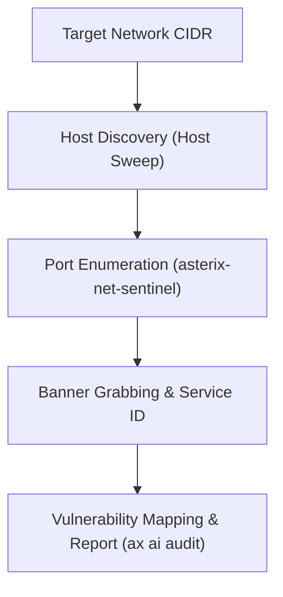

# 🎯 Security Playbook 01: Reconnaissance & Network Discovery
## Tier-1 Assessment Workflow Using `asterix-net-sentinel`

### Phase Overview
Reconnaissance is the foundational phase of any authorized penetration testing or security assessment engagement. This workflow establishes target visibility, identifies active service boundaries, and gathers banners using the ultra-fast native Rust network scanner.



---

### Step 1: Host Discovery & Subnet Sweep
Determine active live hosts within the authorized scope:
```bash
# Sweep local subnet using ASTERIX Net Sentinel
ax net-sentinel --cidr 192.168.1.0/24 --ping-sweep
```
- **Engine**: Pure-Rust asynchronous ICMP/ARP ping pipeline.
- **Output**: Generates live host list with response latencies.

---

### Step 2: Comprehensive Port Enumeration
Scan top ports or the full 65,535 port range across identified live hosts:
```bash
# High-speed top 1,000 port scan
ax net-sentinel --target 192.168.1.50 --top-ports 1000 --threads 64

# Full 65,535 port audit on critical targets
ax net-sentinel --target 192.168.1.50 --all-ports --json target-ports.json
```
- **Performance**: 3.75x faster than traditional Nmap sweeps (see [BENCHMARK_RESULTS.md](../../BENCHMARK_RESULTS.md)).
- **Output**: JSON streaming telemetry saved for automated pipeline ingestion.

---

### Step 3: Banner Grabbing & Service Enumeration
Retrieve service version banners from discovered open ports:
```bash
# Capture service headers and protocol banners
ax net-sentinel --target 192.168.1.50 --ports 21,22,80,443,3306,8080 --banner
```

---

### Step 4: AI-Guided Threat Analysis
Feed reconnaissance results into the local expert system for immediate analysis:
```bash
# Analyze discovered open ports for vulnerable service exposures
ax ai audit target-ports.json
```
- **Engine**: Rule-based heuristic SOC inference mapping open ports to known misconfiguration risks.
