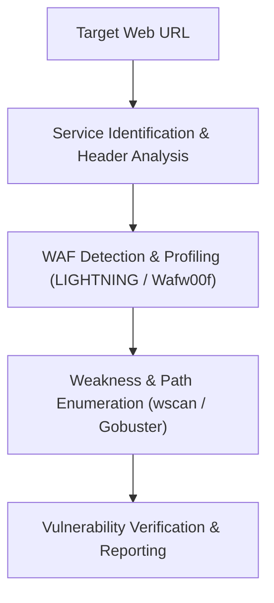

# 🎯 Security Playbook 02: Web Application Security Auditing
## Methodology for Web Weakness Assessment & WAF Verification

### Phase Overview
Web applications represent a primary external attack surface. This workflow guides security researchers and penetration testers through systematic vulnerability discovery, input fuzzing, and Web Application Firewall (WAF) posture verification.



---

### Step 1: Target Profiling & WAF Detection
Inspect HTTP response headers, SSL/TLS parameters, and identify active WAF proxies:
```bash
# Detect and profile intermediate WAF / CDN shields
ax lightning probe https://target.internal.domain
```
- **Capabilities**: Checks for signature anomalies, cookie patterns, and header fingerprints to identify Cloudflare, AWS WAF, ModSecurity, etc.

---

### Step 2: Content Discovery & Path Enumeration
Enumerate hidden endpoints, API routes, and configuration backups:
```bash
# Execute wordlist-based endpoint enumeration
ax web enum https://target.internal.domain --wordlist /usr/share/wordlists/dirb/common.txt
```

---

### Step 3: Weakness Scanning with WSCAN
Scan endpoints for common OWASP Top 10 vulnerabilities (SQLi, XSS, SSRF, IDOR):
```bash
# Launch multi-vector web vulnerability scan
ax wscan --target https://target.internal.domain/app --depth 3 --json web-audit.json
```

---

### Step 4: Defense Verification & Hardening Suggestions
Use ASTERIX AI to generate remediations for discovered web flaws:
```bash
# Generate remediation steps for discovered web issues
ax ai ask "How to patch SQL injection and add parameterized queries in Node.js/PostgreSQL"
```
