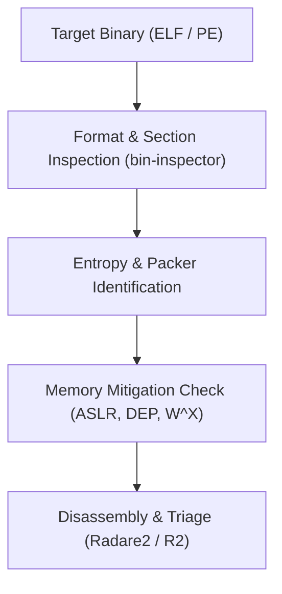

# 🎯 Security Playbook 03: Binary Analysis & Hardening Assessment
## Reverse Engineering & Exploit Mitigation Verification Workflow

### Phase Overview
Binary analysis evaluates compiled executables for security mitigations, obfuscation, unpackers, and memory corruption vulnerabilities. This workflow uses `asterix-bin-inspector`, `asterix-dark-engine`, and `asterix-code-repair`.



---

### Step 1: Format Parsing & Entropy Measurement
Inspect binary headers, sections, and calculate Shannon entropy to detect packed or encrypted code:
```bash
# Run deep static analysis on the target binary
ax bin-inspector ./target_binary
```
- **Detection**: Evaluates sections (`.text`, `.data`, `.rodata`).
- **Entropy Heuristics**: Flags sections with entropy > 7.2 as packed or obfuscated.

---

### Step 2: Binary Hardening Assessment
Verify whether compile-time mitigations are properly enforced:
```bash
# Audit target binary for modern defense mitigations
ax defender check-binary ./target_binary
```
Checks verified:
- **Stack Canaries**: Stack smashing protector present.
- **NX / DEP**: Non-executable stack enforcement.
- **PIE / ASLR**: Position-independent executable support.
- **RELRO**: Full or partial relocation read-only enforcement.
- **Fortify Source**: Buffer overflow checking functions linked.

---

### Step 3: Process Address Space & W^X Verification
When the binary is executed in a controlled test environment, inspect runtime memory permissions:
```bash
# Inspect process memory map for unsafe W^X (rwx) pages
ax dark-engine inspect-pid $(pgrep target_binary)
```

---

### Step 4: Disassembly & AST Verification
Perform static disassembly and fix payload code defects:
```bash
# Disassemble entrypoint and critical functions with Radare2
ax rev -d ./target_binary

# If building harness scripts, heal syntax defects automatically
ax code-repair fix exploit_harness.py
```
