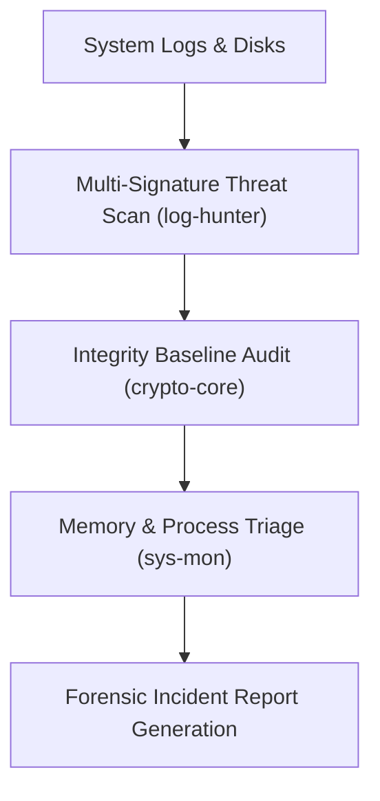

# 🎯 Security Playbook 04: Post-Exploitation Forensics & Incident Response
## Threat Hunting, Artifact Recovery & Timeline Reconstruction

### Phase Overview
Post-exploitation analysis and incident response focus on determining the extent of an intrusion, identifying indicators of compromise (IOCs), validating audit logs, and recovering compromised artifacts using `asterix-log-hunter` and `asterix-crypto-core`.



---

### Step 1: Automated Security Log Triage
Scan auth logs, web access logs, and syslog for known threat indicators and brute-force bursts:
```bash
# Analyze system authentication logs for compromise patterns
ax log-hunter --log /var/log/auth.log --threat-scan

# Analyze web server access logs for injection and traversal signatures
ax log-hunter --log /var/log/nginx/access.log --web-signatures --json incident.json
```
- **Throughput**: 3.79x faster than standard grep/awk pipelines (see [BENCHMARK_RESULTS.md](../../BENCHMARK_RESULTS.md)).

---

### Step 2: Filesystem Integrity & Tampering Audit
Compare current file hashes against a known-good baseline manifest:
```bash
# Generate SHA-256 integrity manifest of critical system binaries
ax crypto-core --manifest /bin,/usr/bin,/etc --output baseline.manifest

# Verify system integrity against baseline to detect backdoors
ax crypto-core --verify baseline.manifest
```

---

### Step 3: Kernel & Process Telemetry Triage
Inspect real-time process states to identify hidden daemon processes or anomalous parent-child relationships:
```bash
# Launch high-frequency process surveillance HUD
ax sys-mon --hud
```

---

### Step 4: Evidence Quarantine & Report
Safely quarantine suspicious artifacts with XOR neutralization:
```bash
# Neutralize and isolate identified malicious files
ax defender quarantine /tmp/.suspect_script

# Compile incident summary report
ax ai audit incident.json
```
