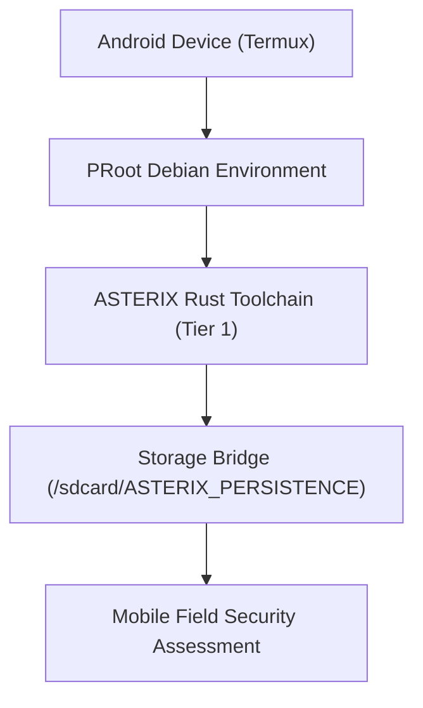

# 🎯 Security Playbook 05: Mobile Security Operations (Termux)
## Portable Security Assessment & Android Offensive Platform

### Phase Overview
ASTERIX OS is engineered as the only complete security platform natively optimized for **Termux PRoot on Android**. This gives penetration testers and security researchers the unique capability to perform reconnaissance, wireless audits, and threat telemetry directly from a mobile phone without needing a heavy laptop.



---

### Step 1: Mobile Environment Bootstrap
Initialize the ASTERIX OS environment inside Termux:
```bash
# Launch ASTERIX OS session inside Termux
termux-mobile/asterix-termux-init.sh
```
- **Lightweight Footprint**: Memory usage under 15 MB for core engines.
- **Persistence Bridge**: Binds `/sdcard/ASTERIX_PERSISTENCE` directly to the workspace, ensuring reports and logs persist across app closures.

---

### Step 2: Portable Network Reconnaissance
Perform wireless subnet sweeps and host discovery on local Wi-Fi networks:
```bash
# Discover all active devices on the local mobile Wi-Fi network
ax net-sentinel --cidr 192.168.43.0/24 --ping-sweep

# Rapid service audit on discovered access points
ax net-sentinel --target 192.168.43.1 --top-ports 100
```

---

### Step 3: Wi-Fi & Wireless Security Auditing
Audit wireless network configurations and assess encryption protocols:
```bash
# Launch THUNDER wireless security suite
ax wifi audit
```

---

### Step 4: Encrypted Field Exfiltration & Sync
Safely package field reports and sync via localhost encrypted vaults:
```bash
# Encrypt and package assessment artifacts to Android internal storage
ax crypto-core --hash-dir ./reports/ --output /sdcard/ASTERIX_PERSISTENCE/field_audit.sha256
```
