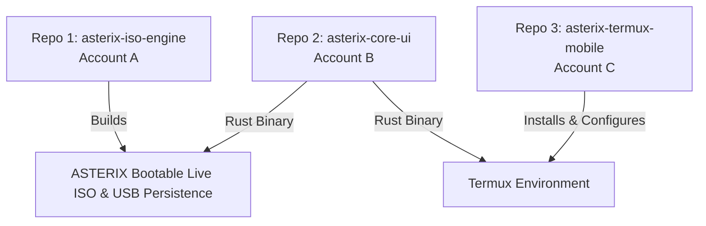

# ASTERIX OS - Multi-Repository Architecture Guide

This guide details how to split and host the **ASTERIX OS** ecosystem across multiple GitHub accounts/repositories as planned.

---

## 🏛️ Repository Separation Architecture



---

## 📦 Breakdown of the 3 Repositories

### Repository 1: `asterix-iso-engine` (Main Build Engine)
* **Target Account:** GitHub Account A (Engine)
* **Purpose:** Builds the standalone bootable `.iso` image using Debian `live-build`.
* **Files to Include:**
  ```
  engine/
  ├── build-iso.sh
  ├── packages.list
  ├── persistence-setup.sh
  └── Dockerfile
  ```
* **How to initialize:**
  ```bash
  cd "ASTERIX OS/engine"
  git init
  git remote add origin https://github.com/<ACCOUNT_A>/asterix-iso-engine.git
  git add .
  git commit -m "feat: initial release of ASTERIX ISO build engine"
  git branch -M main
  git push -u origin main
  ```

---

### Repository 2: `asterix-core-ui` (Rust Loader & Control Hub)
* **Target Account:** GitHub Account B (Main Status / Visuals)
* **Purpose:** Contains the native Rust cybernetic loading screen, animated progress engine, and the interactive TUI Control Center.
* **Files to Include:**
  ```
  ui-core/
  └── asterix-loader/
      ├── Cargo.toml
      ├── build.sh
      └── src/
          └── main.rs
  ```
* **How to initialize:**
  ```bash
  cd "ASTERIX OS/ui-core"
  git init
  git remote add origin https://github.com/<ACCOUNT_B>/asterix-core-ui.git
  git add .
  git commit -m "feat: Rust cybernetic boot loader and control hub"
  git branch -M main
  git push -u origin main
  ```

---

### Repository 3: `asterix-termux-mobile` (Mobile Installer & Storage Bridge)
* **Target Account:** GitHub Account C (Termux Mobile)
* **Purpose:** One-liner mobile installer for Termux with PRoot integration and Android `/sdcard/` persistent storage bridge.
* **Files to Include:**
  ```
  termux-mobile/
  ├── install-termux.sh
  ├── asterix-termux-init.sh
  └── setup-persistence.sh
  ```
* **How to initialize:**
  ```bash
  cd "ASTERIX OS/termux-mobile"
  git init
  git remote add origin https://github.com/<ACCOUNT_C>/asterix-termux-mobile.git
  git add .
  git commit -m "feat: Termux mobile installer with PRoot & persistence"
  git branch -M main
  git push -u origin main
  ```

---

## 🔗 How They Connect Together

Users can install the Termux mobile version with a single command pulling from your Termux repo:

```bash
curl -fsSL https://raw.githubusercontent.com/<ACCOUNT_C>/asterix-termux-mobile/main/install-termux.sh | bash
```

Inside the installer, it can fetch the pre-compiled Rust binary from your `asterix-core-ui` repo or compile it on the fly!
